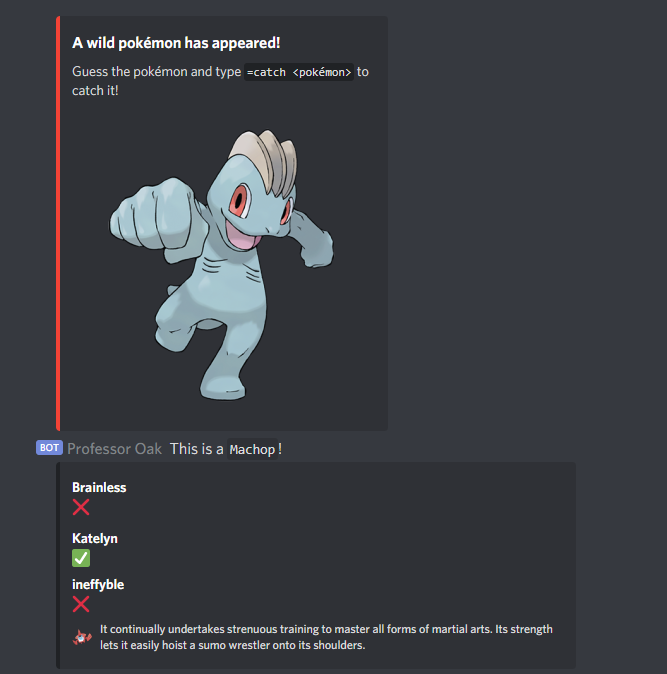

# Professor Oak, the Pokedex assistant

Oak is an assistant for the Discord bot Pokecord.

He sits in your server and watches pokemon spawn, and tells you who has or hasn't caught them.

He'll only show people who are online and have caught at least one pokemon in his preview, so you don't have to worry about him showing users who don't care.
However, I don't recommend him for large servers, as the output can still get somewhat large with too many players.

## Isn't this cheating?

While Oak does use similar mechanisms as auto-catchers to identify pokemon, he's fundamentally different in two ways:

1. Oak does not attempt to catch pokemon.  The way he works, that's not even possible.
1. He posts his information in public, where everyone can see it.

The point of Oak is to give everyone even footing when playing Pokecord on in a small server with friends.
To allow people to intentionally not catch a pokemon they already have, so their friends can fill their dex.

# Why does Oak sometimes not recognise a pokemon?

Pokecord occasionally changes up their images, adds new pokemon, or deploys anti-cheat mechanisms.
He'll learn from watching you catch pokemon though, so fill those dexes and show them to Oak.

(He also hasn't seen many shinies)

# Sounds good, how do I use him?

Invite him to your server with this link! <https://discord.com/api/oauth2/authorize?client_id=590057467111538689&permissions=0&scope=bot>
